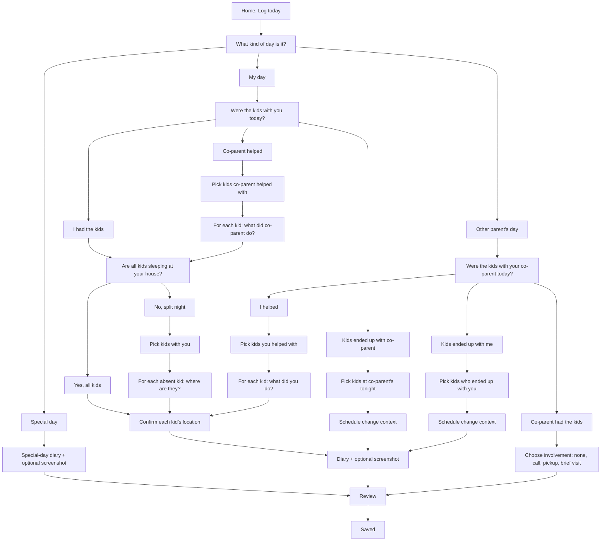
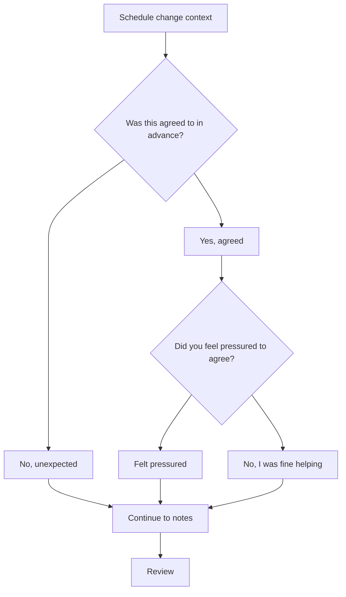

# Custody Tracker Decision Tree

This document describes the current check-in flow as implemented in `index.html` and `app.js`.

## Main Flow

## Schedule Change Context

This screen appears when custody differs from the scheduled day:

- My day -> kids ended up with co-parent
- Other parent's day -> kids ended up with me

## Stored Entry Fields

Core shape:

- `week`: `dad`, `mom`, `other`, or `not-logged`
- `dadMode`: `normal`, `dad-helped-mom`, or `mom-had`
- `momMode`: `easy`, `helped`, or `dad-had`
- `kidsWithDad`
- `absentData`
- `momOpts`
- `helpedKids`
- `helpedData`
- `dadHadKids`
- `momHadKidsOnDadWeek`
- `momHelpedOnDadWeek`
- `diary`
- `attachment`
- `changeAgreed`
- `changePressured`
- `loggedAt`

## Product Decisions

- Users can backfill only yesterday.
- Older empty calendar days show "Nothing logged" and remain read-only.
- Schedule-change context is captured only for true custody deviations, not ordinary involvement such as calls, pickups, or brief visits.

## Odd Paths To Review

- On "My day -> Co-parent helped," the flow asks what co-parent did, then returns to "Are all kids sleeping at your house tonight?" This may be correct, but it can feel like a loop because the help activity comes before the final location question.
- On "Other parent's day -> I helped," the flow ends at the same kids-confirm screen used for overnight location confirmation. That screen language says "where each kid is sleeping," which may not match a daytime help-only scenario.
- On "Other parent's day -> Co-parent had the kids," choosing "Brief visit," "Phone / FaceTime," or "Drop-off or pick-up" goes straight to Review without asking which kid was involved. That may be intentionally lightweight, but it limits report detail.
- Some internal state names still use Dad/Mom terminology. User-facing copy now mostly renders from the configured parent labels, but internal naming could be clarified later during a larger refactor.
- The progress bars use different totals depending on branch. Some branches with schedule-change context may feel longer than the indicator suggests.

## Good Low-Oversight Cleanup Work

- Split decision-tree state helpers into named sections without changing behavior.
- Add browser smoke-test assertions for custom parent/co-parent labels in review, saved, calendar, and report views.
- Add browser smoke-test assertions for the two schedule-change branches.
- Add a small regression checklist to release notes before each push.
