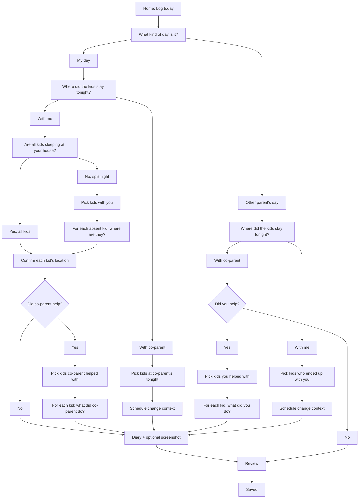
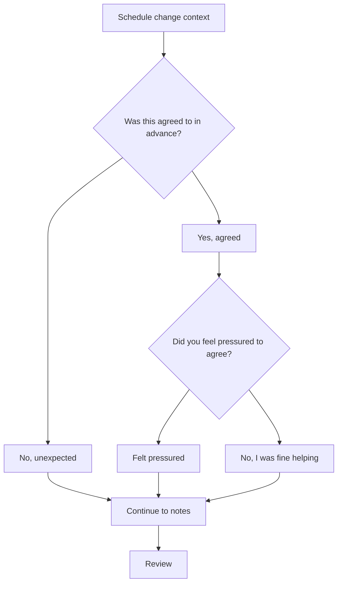

# Whose Day Decision Tree

This document describes the current check-in flow as implemented in `index.html` and `app.js`.

## Main Flow

```mermaid
flowchart TD
  Start["Home: Log today"] --> DayType["What kind of day is it?"]

  DayType --> MyDay["My day"]
  DayType --> TheirDay["Other parent's day"]

  Review --> Saved["Saved"]

  MyDay --> MyDayActual["Where did the kids stay tonight?"]
  MyDayActual --> MyNormal["With me"]
  MyDayActual --> KidsAtCoParent["With co-parent"]

  MyNormal --> AllKidsHome["Are all kids sleeping at your house?"]
  AllKidsHome --> AllYes["Yes, all kids"]
  AllKidsHome --> SplitNight["No, split night"]
  AllYes --> KidsConfirm["Confirm each kid's location"]
  SplitNight --> PickKidsHome["Pick kids with you"]
  PickKidsHome --> AbsentLoop["For each absent kid: where are they?"]
  AbsentLoop --> KidsConfirm
  KidsConfirm --> CoParentHelped{"Did co-parent help?"}
  CoParentHelped --> NoCoParentHelp["No"]
  CoParentHelped --> YesCoParentHelp["Yes"]
  NoCoParentHelp --> Diary["Diary + optional screenshot"]
  YesCoParentHelp --> PickCoParentHelpedKids["Pick kids co-parent helped with"]
  PickCoParentHelpedKids --> CoParentHelpedActivity["For each kid: what did co-parent do?"]
  CoParentHelpedActivity --> Diary
  Diary --> Review

  KidsAtCoParent --> PickKidsAtCoParent["Pick kids at co-parent's tonight"]
  PickKidsAtCoParent --> ChangeContextDadDay["Schedule change context"]
  ChangeContextDadDay --> Diary

  TheirDay --> TheirDayActual["Where did the kids stay tonight?"]
  TheirDayActual --> CoParentHadKids["With co-parent"]
  TheirDayActual --> KidsWithMe["With me"]

  CoParentHadKids --> IHelped{"Did you help?"}
  IHelped --> NoIHelped["No"]
  IHelped --> YesIHelped["Yes"]
  NoIHelped --> Review
  YesIHelped --> PickHelpedKids["Pick kids you helped with"]
  PickHelpedKids --> HelpedActivity["For each kid: what did you do?"]
  HelpedActivity --> Diary

  KidsWithMe --> PickKidsWithMe["Pick kids who ended up with you"]
  PickKidsWithMe --> ChangeContextTheirDay["Schedule change context"]
  ChangeContextTheirDay --> Diary
```

## Schedule Change Context

This screen appears when custody differs from the scheduled day:

- My day -> kids ended up with co-parent
- Other parent's day -> kids ended up with me

```mermaid
flowchart TD
  Change["Schedule change context"] --> Agreed{"Was this agreed to in advance?"}
  Agreed --> Yes["Yes, agreed"]
  Agreed --> No["No, unexpected"]
  Yes --> Pressure{"Did you feel pressured to agree?"}
  Pressure --> Pressured["Felt pressured"]
  Pressure --> Fine["No, I was fine helping"]
  No --> Notes["Continue to notes"]
  Pressured --> Notes
  Fine --> Notes
  Notes --> Review["Review"]
```

## Stored Entry Fields

Core shape:

- `week`: `dad`, `mom`, or `not-logged`
- `dadMode`: `normal`, `dad-helped-mom`, or `mom-had`
- `momMode`: `easy`, `helped`, or `dad-had`
- `kidsWithDad`
- `absentData`
- `momOpts`
- `helpedKids`
- `helpedData`
- `dadHadKids`
- `momHadKidsOnDadWeek`
- `momHelpedOnDadWeek`
- `diary`
- `attachment`
- `changeAgreed`
- `changePressured`
- `loggedAt`

## Product Decisions

- Users can backfill only yesterday.
- Older empty calendar days show "Nothing logged" and remain read-only.
- Help is captured only after actual overnight location is selected.
- Schedule-change context is captured only for true custody deviations, not ordinary help.
- Legacy stored values such as `dad-helped-mom` and `momMode: helped` are still supported, but users now reach them through nested help questions.

## Odd Paths To Review

- Some internal state names still use Dad/Mom terminology. User-facing copy now mostly renders from the configured parent labels, but internal naming could be clarified later during a larger refactor.
- The progress bars use different totals depending on branch. Some branches with schedule-change context may feel longer than the indicator suggests.

## Good Low-Oversight Cleanup Work

- Split decision-tree state helpers into named sections without changing behavior.
- Add browser smoke-test assertions for custom parent/co-parent labels in review, saved, calendar, and report views.
- Add browser smoke-test assertions for the two schedule-change branches.
- Add a small regression checklist to release notes before each push.
